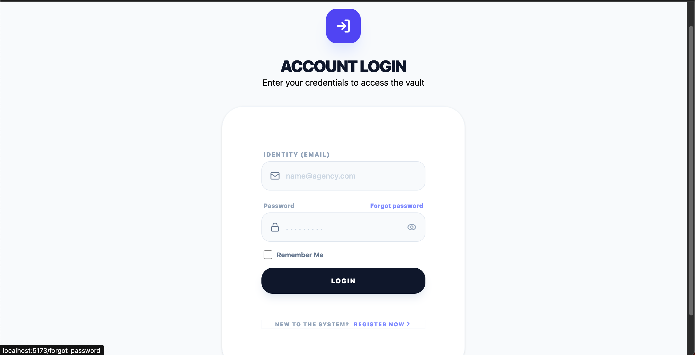
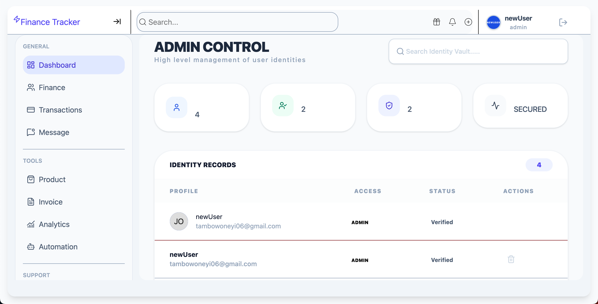
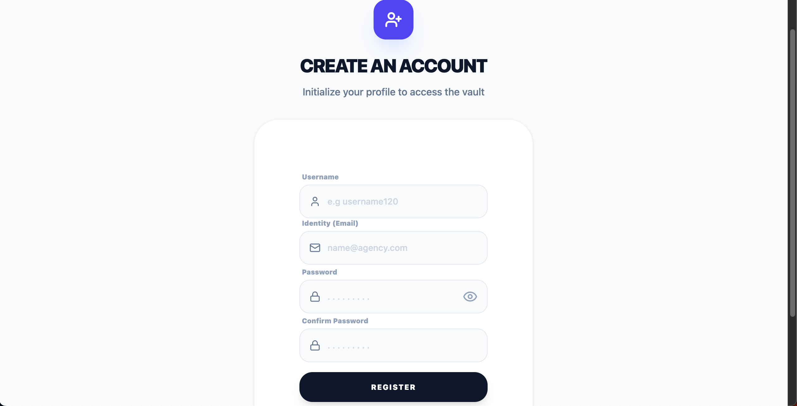
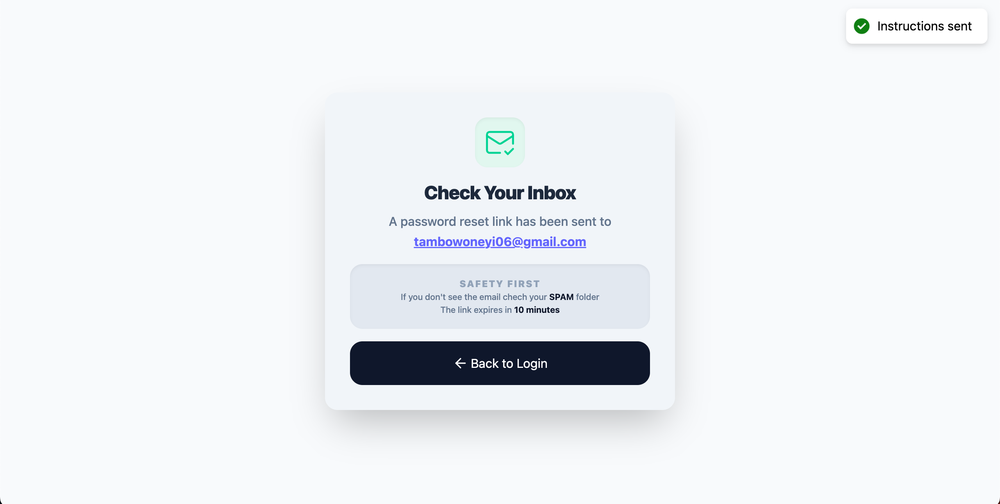
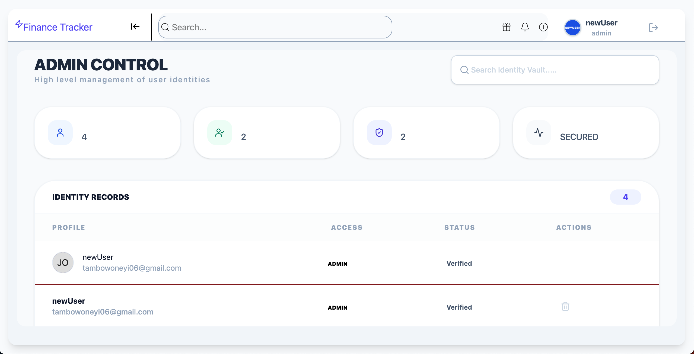
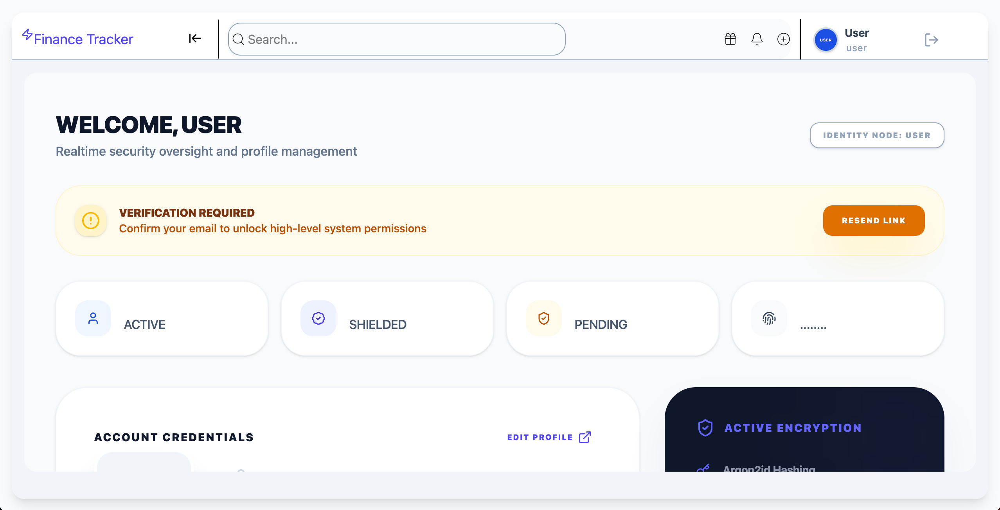
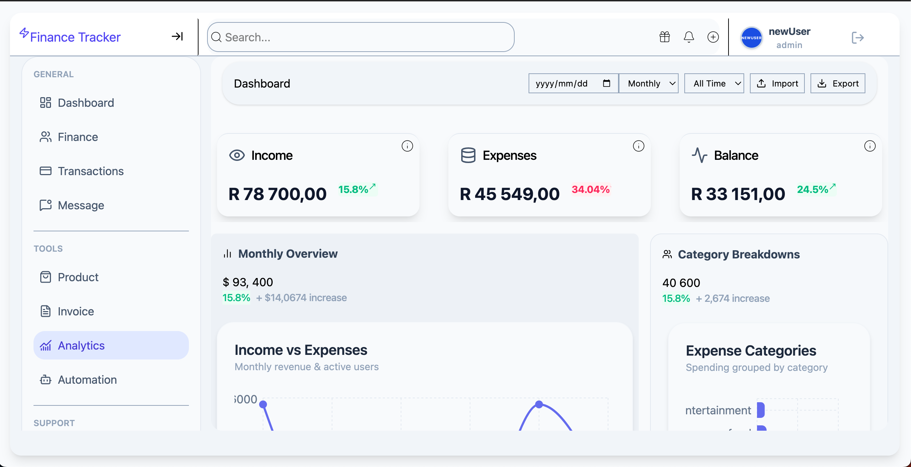

# Finance Tracker V2

A full-stack finance management and identity system built with the MERN stack, featuring authentication, role-based access control, transaction analytics, file uploads, and automated security workflows.

---

## Live Demo
https://finance-tracker-v2-xi.vercel.app/

---

## 📸 Screenshots

### Authentication Flow

### Dashboard

### Analytics

### Admin Control Panel

---

## Key Features

### 🔐 Authentication & Security
- JWT-based authentication (HTTP-only cookies)
- Email verification system (Nodemailer)
- Password reset workflow
- Argon2 password hashing
- Protected routes + middleware guards

### 📊 Finance System
- Income / Expense tracking
- Category-based classification
- Transaction history (CRUD)
- CSV import & export

### 📈 Analytics Engine
- Income vs Expense visualisation
- Category breakdown charts
- Monthly trend analysis
- Real-time balance calculation

### 👤 Identity & Admin Layer
- Role-based access control (User / Admin)
- Admin dashboard for identity oversight
- User verification status tracking
- Account lifecycle management

### 📁 File System
- File upload support (multer)
- Secure file routing layer
- Storage abstraction layer

---
 Tech Stack

### Frontend
- React
- Vite
- TailwindCSS
- Recharts
- Context API

### Backend
- Node.js
- Express.js
- MongoDB + Mongoose
- JWT Authentication
- Nodemailer
- Multer
- Argon2
---
### Dev Tools
- Git branching strategy
- Vercel (frontend deployment)
- Railway/Render (backend deployment)

---
 Security Model

- HTTP-only JWT cookies
- Role-based route protection
- Password hashing (Argon2)
- CORS whitelisting
- Input validation middleware
- Email verification gating

---

## 📊 API Endpoints

### Auth
- POST /auth/v2/register
- POST /auth/v2/login
- POST /auth/v2/logout
- POST /auth/v2/verify
- POST /auth/v2/reset-password

### Transactions
- GET /finances/v2
- POST /finances/v2
- PATCH /finances/v2/:id
- DELETE /finances/v2/:id

### Files
- POST /files/v2/upload
- GET /files/v2/:id

---

##  What I Learned

- Full-stack architecture design
- Authentication flow design (JWT + cookies)
- Service-layer backend architecture
- Data visualisation with real-time updates
- Role-based system design
- API versioning strategies

---

## 🚧 Future Improvements

- Multi-user shared finance spaces (roommates/families mode)
- Bank transaction auto-sync
- Budget threshold email alerts
- WebSocket real-time updates
- Mobile app version (React Native)

---

##  Author

Built by **Tambowoneyi Zvirevo**

